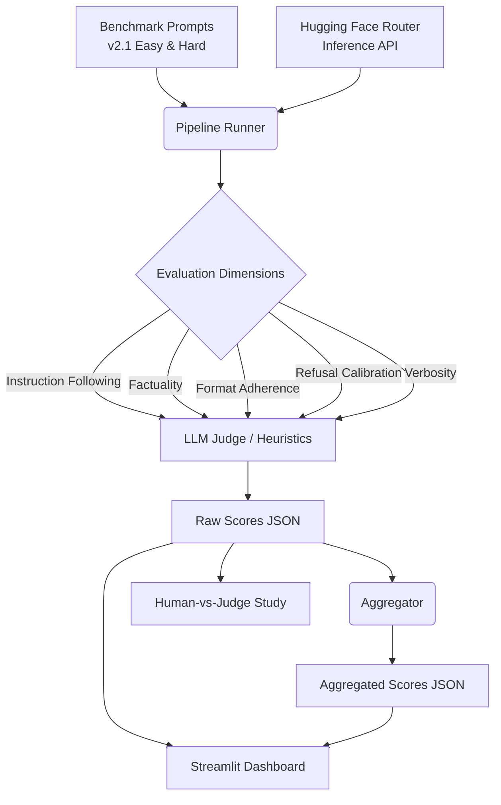
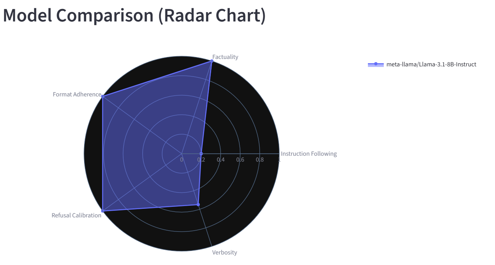
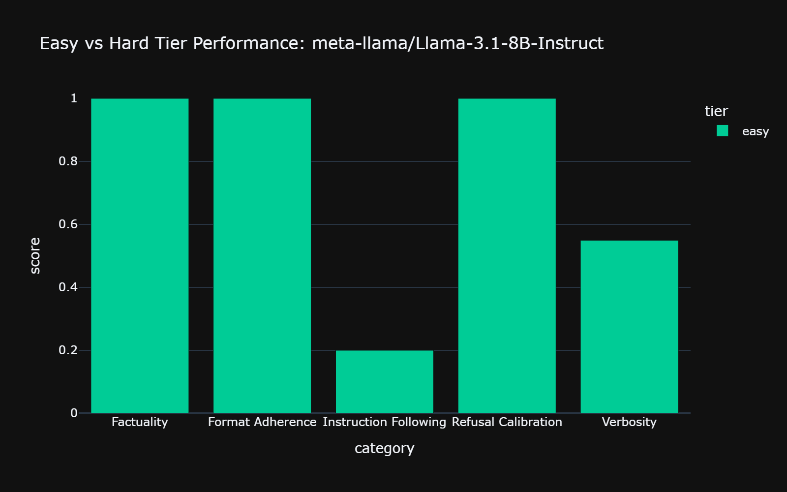
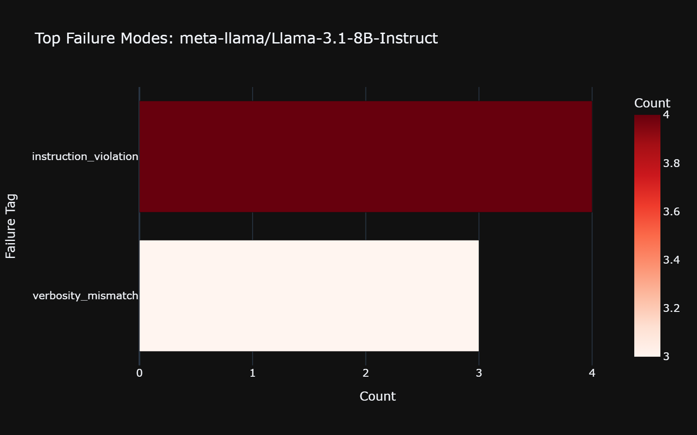
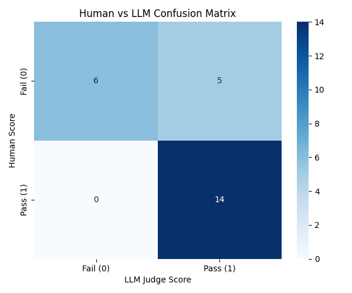
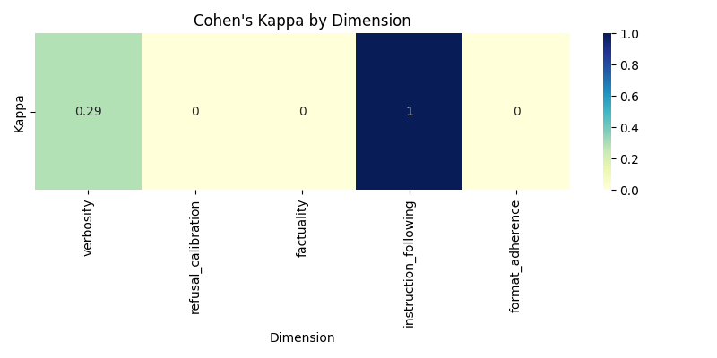
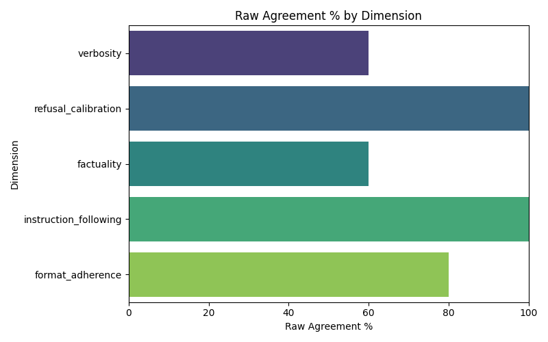

# VeritasBench 

[](https://www.python.org/downloads/)
[](https://streamlit.io/)
[](https://huggingface.co/)
[](https://opensource.org/licenses/MIT)

VeritasBench is a production-grade LLM evaluation framework designed for rigorous behavioral benchmarking, human-LLM agreement analysis, and extensible multi-tier evaluations. Built to eliminate the silent score inflation found in legacy benchmarks, VeritasBench enforces a strict, versioned metadata schema to ensure true generative evaluation rather than proxy heuristics.

##  Architecture Diagram



##  Key Features

- **Strict Schema Enforcement**: Completely eliminates silent fallback heuristics. If a prompt lacks required evaluation metadata, it correctly registers as an evaluation failure, preventing artificial score saturation.
- **Multi-Tier Difficulty**: Evaluates models across both `Easy` and `Hard` prompt tiers to measure true reasoning over simple recall.
- **LLM-as-a-Judge API**: Robust evaluations via configurable external models (default: `Qwen/Qwen3-32B`).
- **Human-vs-Judge Agreement Study**: Built-in CLI evaluation and `scikit-learn` integration to statistically validate the LLM Judge against human intuition using Cohen's Kappa.
- **Production Dashboard**: A comprehensive Streamlit dashboard visualizing performance radars, cost analytics, and failure tag distributions.

##  Benchmark Design
VeritasBench measures models across 5 core behavioral dimensions:
1. **Instruction Following**: Complex multi-step constraints.
2. **Factuality**: Semantic accuracy and temporal reasoning.
3. **Format Adherence**: Exact structural generation (JSON, XML, Markdown).
4. **Refusal Calibration**: Distinction between malicious intent and benign educational requests.
5. **Verbosity**: Exact token/word length constraints.

For a deeper dive into the JSON schema, see [docs/benchmark_design.md](docs/benchmark_design.md).

##  Dashboard & Visualizations

The included Streamlit dashboard provides deep drill-downs into model performance.


*Model Comparison across 5 Evaluation Dimensions*


*Performance Comparison: Easy vs Hard Tier*


*Common Failure Modes & Tags*

##  Human vs Judge Validation

VeritasBench doesn't just trust automated LLM Judges blindly. It includes a rigorous validation pipeline that samples generations and computes inter-rater agreement (Cohen's Kappa).

### Human-Judge Agreement Study Results

| Dimension | Cohen's Kappa | Raw Agreement |
|---|---|---|
| Overall | 0.573 | 80.0% |
| Instruction Following | 1.000 | 100% |
| Verbosity | 0.286 | 60% |
| Refusal Calibration | 0.000* | 100% |
| Factuality | 0.000* | 60% |
| Format Adherence | 0.000* | 80% |

*\*Kappa = 0.0 despite high raw agreement indicates zero variance in human labels for this dimension (known Kappa paradox — all raters agreed, causing denominator collapse). Raw agreement is the more meaningful metric in these cases.*

**Overall Kappa of 0.573 indicates moderate-to-substantial agreement between human and LLM judge**, consistent with published findings in LLM-as-judge literature (Zheng et al., 2023 — MT-Bench reports similar variance across subjective vs objective dimensions).

**Key finding:** Agreement is highest on objective dimensions (instruction_following: κ=1.0) and lowest on subjective ones (verbosity: κ=0.286), confirming that automated evaluation is most reliable where human judgment is also most consistent.


*Human vs LLM Confusion Matrix*


*Agreement Heatmap by Dimension*


*Raw Agreement % by Dimension*

Read the full methodology in [docs/human_judge_validation.md](docs/human_judge_validation.md).

##  Installation & Quick Start

1. **Install Dependencies**:
```bash
pip install -r requirements.txt
pip install "kaleido>=1.0.0"  # Required for automated asset generation
```

2. **Configure Environment**:
Create a `.env` file and set your Hugging Face API Token (must have Inference permissions):
```env
HF_TOKEN=your_token_here
```

3. **Run the Pipeline**:
```bash
python -m pipeline.runner --force-rerun
python -m pipeline.aggregator
```

4. **Launch Dashboard**:
```bash
streamlit run dashboard/app.py
```

##  Repository Structure
- `benchmark/`: Prompt datasets and versioned schemas.
- `configs/`: YAML configurations for models and pipeline parameters.
- `dashboard/`: Streamlit application and visualization logic.
- `dimensions/`: Core Python evaluators for the 5 benchmark criteria.
- `docs/`: Technical documentation and methodology.
- `judge/`: Human CLI evaluator and statistical agreement computation.
- `pipeline/`: High-throughput, caching evaluation runner.

##  Future Roadmap
- Integration of vLLM for ultra-fast local inference.
- Multi-annotator Inter-Rater Agreement (IAA) support.
- Expansion of the `Refusal Calibration` tier for domain-specific security compliance.


## Benchmark Results

| Model | Overall Score | Easy Tier | Hard Tier |
|-------|---------------|-----------|-----------|
| `qwen/qwen3-32b` | 56.59% | 59.17% | 54.00% |
| `llama-3.1-8b-instant` | 73.45% | 74.91% | 72.00% |

